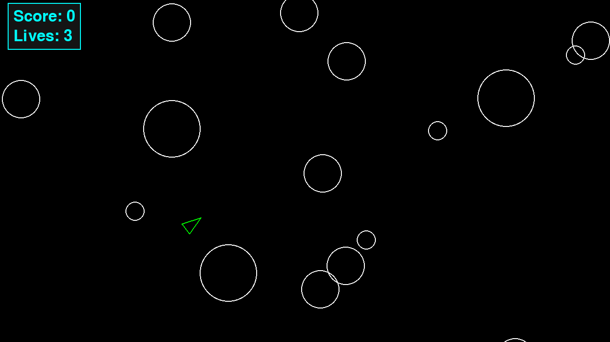

Asteroids
===


A recreation of the classic **Asteroids** arcade game using Python and Pygame.

I originally built this project to practice object-oriented programming in Python. After getting the core game working, I refactored the project to improve its class structure, separate responsibilities, add type hints, and introduce automated testing. 

The project helped me move beyond simply creating classes and better understand how abstraction, inheritance, polymorphism and object responsibilities can be applied to a working program. 



### Features

- Player movement and rotation
- Projectile shooting with a cooldown
- Random asteroid spawning 
- Multiple asteroid sizes
- Asteroids split into smaller, faster asteroid when hit
- Circle-based collision detection
- Score system based on asteroid size
- Player lives 
- Respawning after collisions
- Temporary invulnerability after respawning
- HUD displaying score and remaining lives
- Automated tests for core game logic 

### Tech Stack 

- **Python 3.12+**
- **Pygame 2.6.1**
- **pytest 9.x**
- **setuptools** for package configuration

### Project Structure 

```
asteroids_game/
├── src/
│   └── asteroids/
│       ├── actors/
│       │   ├── asteroid.py
│       │   ├── player.py
│       │   └── shot.py
│       ├── engine/
│       │   └── circleshape.py
│       ├── systems/
│       │   └── asteroidfield.py
│       ├── constants.py
│       ├── game.py
│       └── main.py
├── tests/
│   ├── test_asteroid.py
│   ├── test_circleshape.py
│   └── test_game.py
└── pyproject.toml
```

This project is separated by responsibility:

- `actors/` contains objects that exist in the game world, including the player, asteroids and shots.
- `engine/` contains shared foundational behaviour used by game entities. 
- `systems/` contains behaviour that manages parts of the game world, such as asteroid spawning. 
- `game.py` coordinates game state, collisions, rendering, updates, and the main game loop. 
- `main.py` acts as the applications entry point. 
- `tests/` contains automated tests for core game behaviour. 


### Object-Oriented Design 

#### Abstraction

`CircleShape` is an abstract base class representing game entities that use circular collision boundaries. 

It stores state shared by these entities: 
- position
- velocity
- radius

It also provides shared circle-to-circle collision detection. 

The class defines `draw()` and `update()` as abstract methods. This requires concrete subclasses to decide how they should be rendered and updated instead of providing behaviour that may not make sense for every game entity.

A generic `CircleShape` is not intended to exist directly in the game. Instead, it establishes common state, behaviour and a contract for the concrete game entities. 


### Inheritance 

`Player`, `Asteroid` and `Shot` inherit from `CircleShape`.

This allows them to reuse common functionality such as position, velocity, radius, Pygame sprite behaviour, and collision detection without duplicating that logic in every class. 

Each subclass then adds behaviour specific to its responsibility.

For example:

- `Player` handles player movement, rotation, shooting, cooldowns and invulnerability.
- `Asteroid` handles asteroid movement and splitting into smaller asteroids. 
- `Shot` handles projectile movement and rendering.


### Polymorphism

This game uses polymorphism through the shared `draw()` and `update()` interfaces.

For example, the game can update a collection of different objects without needing to know their exact types: 

```python
self.updatable.update(self.dt)
```

Likewise, drawable entities can be rendered through the same interface:

```python
for sprite in self.drawable:
    sprite.draw(self.screen)
```

A `Player`, `Asteroid` and `Shot` all respond to these operations differently, but the `Game` class does not need type-specific conditionals to determine how each object should behave.


### Responsibility and Encapsulation 

One of the main goals of the refactor was deciding which object should be responsible for each behaviour. 

For example, the `Game` class owns overall game state and coordination:

- score
- lives
- sprite groups 
- collision coordination 
- event handling 
- rendering 
- game lifecycle 

The `Player` manages behaviour specific to the player, including movement, shooting, cooldowns, and invulnerability.

The `Asteroid` knows how to split itself, while the `Game` determines when a collision should cause that split. 

This separation keeps individual classes focused and prevents the main game loop from containing all of the application's logic.


### Testing 

This project included automated tests using pytest.

The current test suite verifies core behaviour including: 
- overlapping circles are detected as collisions
- separated circles do not collide
- circles touching at their boundaries count as a collision
- different asteroid sizes award the expected scores
- smallest sized asteroids are destroyed without producing further children
- larger asteroids split into two smaller asteroids
- split asteroids spawn at the correct position
- split asteroids move faster than their parent

Run the full test suite from the project root using:

```bash
pytest -v
```

#### Installation
##### 1. Clone this repository

```bash
git clone https://github.com/Ghostlybot16/asteroids_game.git
cd asteroids_game
```

##### Create a virtual environment

```bash
python -m venv .venv
```

Activate it on Windows: 

```bash 
.venv/Scripts/activate
```

On macOS/Linux:

```bash
source .venv/bin/activate
```

##### Install the project

To install game:

```bash
python -m pip install -e .
```

For development, including pytest:

```bash
python -m pip install -e ".[dev]"
```

##### Running the Game
From the repository root:

```bash
python -m asteroids.main
```

##### Controls
W - Forward
S - Backwards
A - Rotate Left 
D - Rotate Right 
Space - Shoot 

Destroying smaller asteroids award more points. Colliding with an asteroid costs one life, and the player receives a short period of invulnerability after respawning. 

#### What I Learned 

- **Abstraction** should represent a real shared concept. `CircleShape` is useful because several entities genuinely share state and collision behavior.

- **Inheritance is most useful when it removes meaningful duplication.** The game entities inherit common functionality while retaining their own behavior.

- **Polymorphism can simplify orchestration.** The game loop can update and draw different objects through a shared interface instead of checking each object's concrete type.

- **Not everything needs its own class.** During the refactor, I deliberately avoided introducing abstractions that would add complexity without making the code easier to understand.

- **Responsibilities matter.** Moving game-wide state and coordination into Game made the purpose of the entity classes clearer.

- **Refactoring should preserve behaviour.** I tested the game throughout the refactor to make sure structural changes did not change gameplay.

- **Automated tests make refactoring safer.** Adding pytest tests gave me a repeatable way to verify collision detection, scoring, and asteroid splitting.

- **Project structure matters as a codebase grows.** Separating actors, engine behavior, systems, tests, and application orchestration made the project easier to navigate and reason about.

Overall, this project gave me practical experience applying object-oriented programming principles to a working application rather than using them only in isolated exercises. 